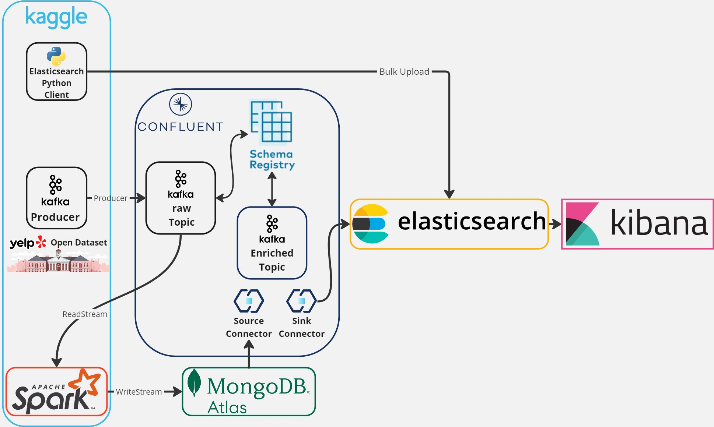
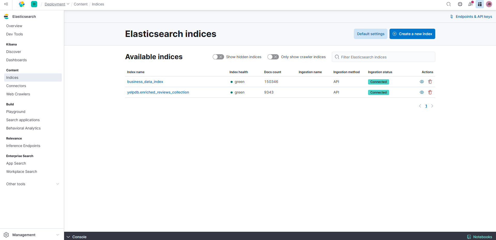
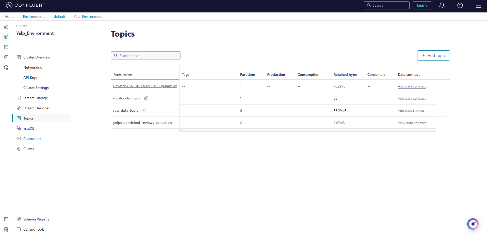
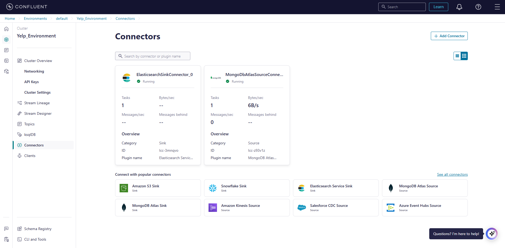
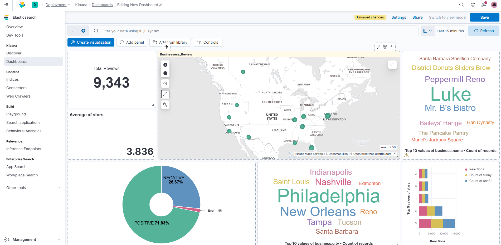

# Real-time Sentiment Analysis of Yelp Reviews using Kafka, Spark, MongoDB, Elasticsearch, and Kibana

This project demonstrates a real-time data pipeline for sentiment analysis of Yelp reviews. It utilizes a combination of cutting-edge technologies to ingest, process, analyze, and visualize large volumes of data in real-time.

## System Architecture

The architecture consists of the following components:

*   **Kafka Producer:** Streams Yelp review data from a source (e.g., a file or database) into Kafka topics.
*   **Apache Spark Streaming:** Processes the incoming stream of reviews, performs sentiment analysis using a pre-trained model (e.g., Hugging Face's DistilBERT), and enriches the data.
*   **MongoDB Atlas:** Stores the enriched review data, providing a persistent and scalable database.
*   **Confluent Kafka Connect:** Uses a Source Connector to ingest data from MongoDB into Kafka for further processing.
*   **Elasticsearch:** Indexes the enriched review data for efficient search and analysis.
*   **Kibana:** Visualizes the data through interactive dashboards, providing real-time insights into sentiment trends and other metrics.

## Technologies Used

*   **Programming Languages:** Python, Scala (for Spark)
*   **Message Broker:** Apache Kafka (Confluent Platform)
*   **Stream Processing:** Apache Spark Structured Streaming
*   **Database:** MongoDB Atlas
*   **Search and Indexing:** Elasticsearch
*   **Visualization:** Kibana
*   **Sentiment Analysis Model:** Hugging Face Transformers (e.g., DistilBERT)
*   **Cloud Platforms:** (Potentially AWS, as mentioned in the transcript)

## Setup and Deployment

### 1. Data Acquisition

*   Obtain the Yelp dataset (business.json and reviews.json) from Kaggle or another source.

### 2. Elasticsearch Setup

*   Deploy an Elasticsearch cluster (e.g., using Elastic Cloud).
*   Create an index named "reviews" with appropriate mappings for the Yelp data.
*   Create an enrichment policy to extract business details.
*   Create an ingestion pipeline to enrich reviews with business data during indexing.

### 3. Confluent Kafka Setup

*   Create a Confluent Cloud account and set up a Kafka cluster.
*   Create the following Kafka topics:
    *   `raw_data_topic`: For raw review data from the Kafka producer.
    *   `yelpdb.enriched_reviews_collection`: For data from MongoDB via the Source Connector.
*   Define Avro schemas for the topics to ensure data consistency.

### 4. Kafka Producer

*   Develop a Kafka producer application (e.g., using Python) to read Yelp review data and stream it to the `raw_data_topic` topic.
*   Implement checkpointing to ensure fault tolerance and prevent data loss.

### 5. MongoDB Atlas Setup

*   Deploy a MongoDB Atlas cluster.
*   Create a database named "yelpdb" and a collection "enriched_reviews_collection".
*   Configure network access and create database users with appropriate privileges.

### 6. Spark Streaming Application

*   Develop a Spark Streaming application (e.g., using PySpark) to:
    *   Consume data from the `raw_data_topic` Kafka topic.
    *   Perform sentiment analysis using the Hugging Face model.
    *   Enrich the reviews with sentiment labels.
    *   Write the enriched data to the `enriched_reviews_collection` Kafka topic and the MongoDB collection.
*   Implement checkpointing for fault tolerance.

### 7. Confluent Kafka Connect Setup

*   Configure a MongoDB Atlas Source Connector in Confluent Cloud to read data from the "enriched_reviews_collection" collection in MongoDB and publish it to the `yelpdb.enriched_reviews_collection` Kafka topic.
*   Configure an Elasticsearch Sink Connector to subscribe to the `yelpdb.enriched_reviews_collection` topic and index the data into the "reviews" index in Elasticsearch.

### 8. Kibana Dashboard Creation

*   Create a Kibana dashboard to visualize the data in real-time.
*   Add visualizations for:
    *   Sentiment distribution (e.g., pie chart or donut chart).
    *   Average star rating.
    *   Number of reviews over time (e.g., line chart).
    *   Top reviewed businesses and cities (e.g., tag clouds).
    *   Geographic distribution of reviews (e.g., map).
    *   Other relevant metrics and insights.

    

## Screenshots

### Confluent Kafka Topics

*Description:* This screenshot shows the list of Kafka topics in Confluent Cloud, including the raw_reviews topic, the enriched_reviews topic, and the topic for data from MongoDB.

### MongoDB Atlas Collections

*Description:* This screenshot displays the collections in the MongoDB Atlas database, including the enriched_reviews_collection that stores the processed Yelp review data.

### Kibana Dashboard

*Description:* This screenshot showcases the Kibana dashboard with various visualizations, providing real-time insights into the sentiment analysis results and other metrics.

**(Add more screenshots as needed)**

## Running the Pipeline

1.  Start the Kafka producer to stream data from the Yelp dataset.
2.  Run the Spark Streaming application to process the data and perform sentiment analysis.
3.  Ensure that the Confluent Kafka Connect connectors are running to sync data between MongoDB, Kafka, and Elasticsearch.
4.  Open the Kibana dashboard to visualize the real-time data stream.

## Conclusion

This project demonstrates a robust and scalable real-time data pipeline for sentiment analysis. By leveraging the power of Kafka, Spark Streaming, MongoDB, Elasticsearch, and Kibana, we can gain valuable insights from large datasets and make data-driven decisions in real-time.

Feel free to contribute to this project by submitting pull requests or opening issues for bug fixes or feature requests.